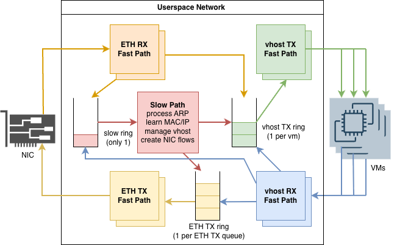

# microvm-networking
> The actual DPDK stack code is still WIP (private repo), but here's the rough architecture.

## Experiments
test on:
- TAP
- OVS-DPDK
- custom DPDK stack

### Multinode VM-VM
Setup:
- node 0: n VMs as iperf3/sockperf client
- node 1: n VMs as iperf3/sockperf server
- n = [1, 64]

Metrics:
- throughput: iperf3 -P 4 -t 30
- p99 latency: sockperf ping-pong -m 64 -t 30
- received/lost PPS: iperf3 -u -b 2G -P 4 -l 1472 -t 30 

### FaaS Workload test
Setup:
- node 0: wrk2 client
- node 1: n VMs as Nginx server
- each node receives N requests/s from node 0

Metrics:
- p99 latency

### Related Repos
- [gRPC server for managing Firecracker microVMs in node](https://github.com/bookpanda/firecracker-runner-node)
- [microVMs vsock server (for sending commands)](https://github.com/bookpanda/firecracker-vsock)
- [CloudLab profile configuration](https://github.com/bookpanda/cloudlab-microvm-profile)

### Infrastructure
Since macbooks don't have KVM support, need to use a baremetal server to run Firecracker's microVMs:
- use [cloudlab.us](https://cloudlab.us) m510, c6525-25g (for DPDK)
- [Cloudlab specs](https://docs.cloudlab.us/hardware.html)

### m510 Specs
- CPU: Eight-core Intel Xeon D-1548 at 2.0 GHz
- RAM: 64GB ECC Memory (4x 16 GB DDR4-2133 SO-DIMMs)
- Disk: 256 GB NVMe flash storage
- NIC: Dual-port Mellanox ConnectX-3 10 GB NIC (PCIe v3.0), 8 lanes (one port available for experiment use)

### c6525-25g Specs
- CPU: 16-core AMD 7302P at 3.00GHz
- RAM: 128GB ECC Memory (8x 16 GB 3200MT/s RDIMMs)
- Disk: Two 480 GB 6G SATA SSD
- NIC: Two dual-port Mellanox ConnectX-5 25Gb GB NIC (PCIe v4.0) (two ports available for experiment use)

### Firecracker microVM Specs
- kernel: [vmlinux-5.10.223-no-acpi](http://spec.ccfc.min.s3.amazonaws.com/firecracker-ci/v1.10/x86_64/vmlinux-5.10.223-no-acpi) (36MB)
- root FS: [debian-rootfs.ext4](http://spec.ccfc.min.s3.amazonaws.com/ci-artifacts/disks/x86_64/debian.rootfs.ext4) (1000MB)